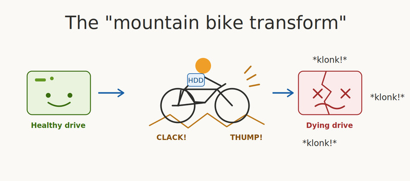
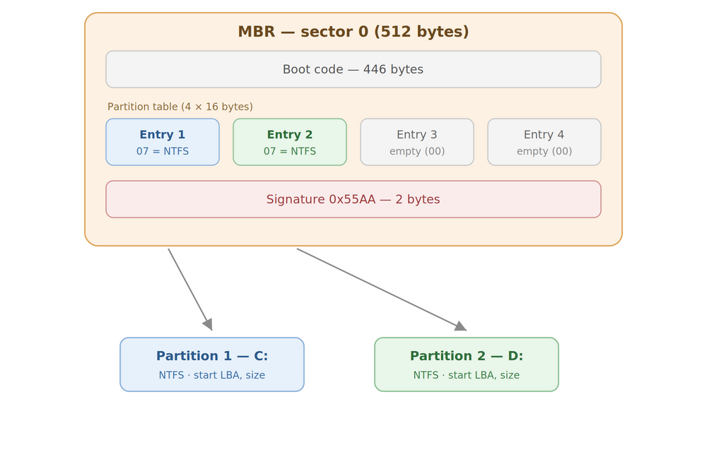
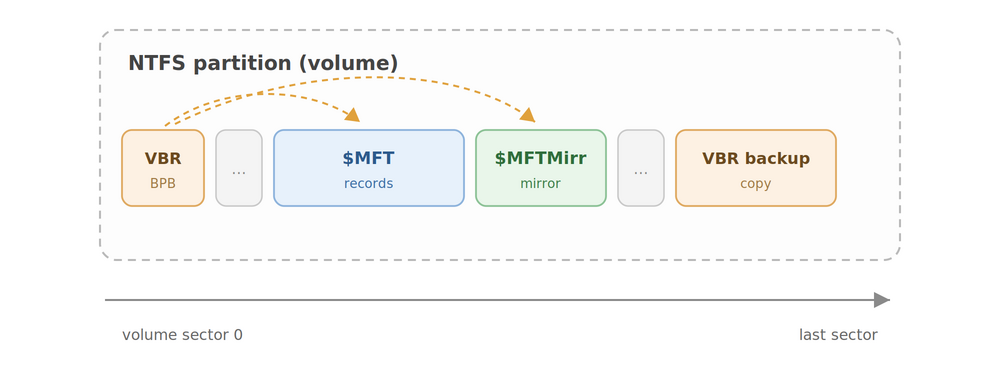
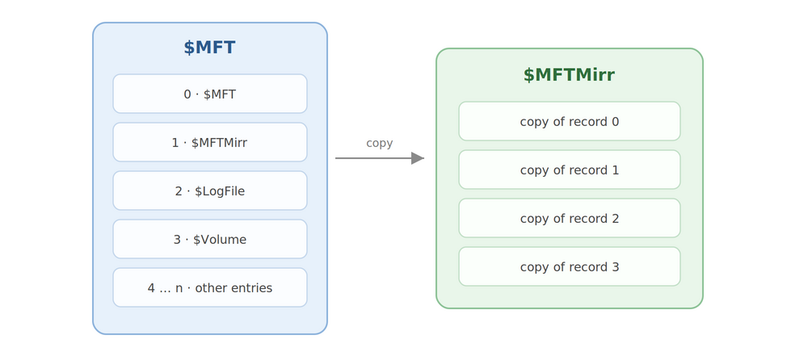
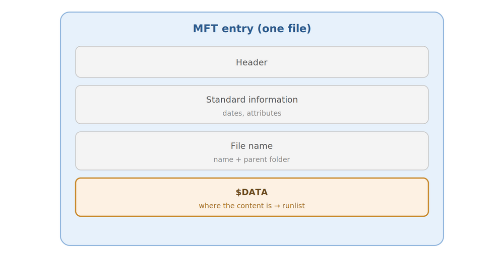
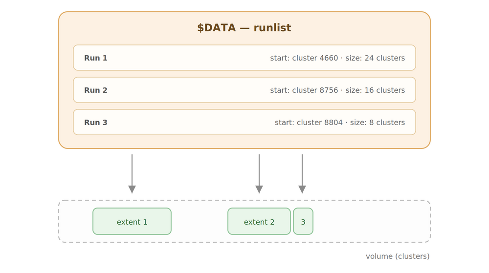

## First, a warning

Attempting to recover data from a physically dying drive **carries significant risk**. Every read, every operation, every second the drive spends powered on carries a real risk of **making its condition worse**, and of causing **irreversible data loss**.

This article should be treated as educational content. If you have a dying drive holding data that genuinely matters, the only thing I would recommend is calling a professional data recovery company, because any handling or use of the drive risks killing the data for good — at which point nobody can do anything about it, not even a professional lab. If you permanently lose your data because you didn't take that advice, I accept no responsibility.

## The situation

My father-in-law carried his external hard drive around on a mountain bike.

For readers born after 2010, let me be specific: a *mechanical* hard drive. An object with platters spinning at 5400 RPM and read heads flying above them at a minuscule distance. It's a marvel of precision engineering, and it's precisely the kind of object you avoid shaking.

The result: 800 GB of data, on a 2 TB drive that goes "klonk klonk" when you plug it in.



That noise has a precise mechanical meaning. When a head fails to read a sector, the firmware retries, then eventually sends the heads back to their default position to try again, producing a characteristic sound: "klonk" (also known as the "click of death"). Every klonk is the firmware admitting defeat — and one more opportunity for a damaged head to plough the magnetic surface it is supposed to be flying over.

On the software side, the picture was no cheerier. The drive obviously wouldn't *mount*, and `dmesg` was cursing me out at length:

```
[46227.209510] sd 0:0:0:0: [sda] tag#0 FAILED Result: hostbyte=DID_OK driverbyte=DRIVER_OK cmd_age=5s
[46227.209544] sd 0:0:0:0: [sda] tag#0 Sense Key : Medium Error [current] 
[46227.209562] sd 0:0:0:0: [sda] tag#0 Add. Sense: Unrecovered read error
[46227.209581] sd 0:0:0:0: [sda] tag#0 CDB: Read(10) 28 00 00 00 00 40 00 00 08 00
[46227.209601] critical medium error, dev sda, sector 64 op 0x0:(READ) flags 0x0 phys_seg 1 prio class 2
[46227.209628] Buffer I/O error on dev sda, logical block 8, async page read
```

The diagnosis firmed up quickly: the *beginning* of the drive was unreadable. And the beginning of the drive, as we'll see, is where all the metadata lives — the metadata that normally lets you find your way around. The drive was partitioned with MBR, so there was no backup GPT table at the end of the drive. The NTFS boot sector (VBR): unreadable. Its backup copy: also unreadable.

In other words: 800 GB of data probably intact somewhere on the platters, and not a single signpost left to say where.

## The wrong instinct: read everything

The natural reflex when faced with a damaged drive is to reach for a classic recovery tool — PhotoRec, TestDisk — or to clone the whole drive with `dd` or ddrescue and then work on the copy. That's the right reflex for a drive that is *physically healthy* but *logically damaged* (deleted files, reformatting, corruption, and so on). On a *physically dying* drive, it's a race against the clock that you start by deciding to run a marathon.

Let's do the math. Cloning 2 TB at, say, 100 MB/s in the best case is roughly five hours of continuous reading. Five hours of spinning, reading and retrying over damaged zones, with heads that we already know are in bad shape. Every hour of operation increases the probability that the drive dies *during* the recovery, taking with it whatever was left to read.

The right strategy is the opposite: read the strict minimum, in the right order, and leave the drive alone the rest of the time. But "read the strict minimum" presupposes knowing *where* the data you want lives. And to know where it is, you have to read the filesystem metadata. Which is itself on the drive. Whose beginning is dead.

First, a word about the tool that will be doing all of our reads: GNU ddrescue. Its philosophy rests on two ideas. One, read whatever reads easily first, and only grind away at the difficult zones at the end — the opposite of `dd`, which will block for hours on the first dead sector. Two, keep a journal, the *mapfile*, recording the state of every byte range: recovered (`+`), untried (`?`), failed (`-`), and so on. Thanks to the mapfile, you can interrupt and resume a recovery at will without ever reading the same thing twice.

In keeping with the traditional philosophy of this class of tool, ddrescue does one thing but does it well. It recovers the raw data from the drive, and takes absolutely no interest in the structure of the filesystem.

And ddrescue has a lesser-known option that will be the keystone of the whole operation: `-m mapfile`, which restricts the recovery to a *domain* — a list of byte ranges, described in the mapfile format as well. Give it a map of the interesting regions and it will read only those.

So the idea is to build a tool that produces the map, which we then feed to ddrescue to steer it towards the critical zones we want recovered first.

## Where are the files, exactly?

To build a map, you have to understand the territory. So let's take it all apart.

Physically, a mechanical drive has platters, tracks/cylinders and sectors, but from the computer's point of view a drive is nothing more than an enormous array of 512-byte sectors (though some recent drives use 4096-byte sectors), numbered from 0 to four billion and change. No files, no folders, no partitions: bytes at addresses. Everything else — partitions, filesystems, files — is merely a convention for interpreting those bytes. They are data like any other, stored in the very array they describe.

There's an excellent tool called `photorec` which, contrary to what its name suggests, can recover a whole range of file types and not just images. It does what's known as "data carving": it blithely ignores any filesystem and walks the entire drive to recover the raw contents of files. There are, however, several downsides:

 * You have to read the *entire* drive (not great in our case)
 * You lose the filenames (you recover only their content, and their type)
 * Fragmented files come back mutilated, missing their scattered fragments

This method is really the last-resort option, for when you genuinely can't get any information out of the filesystem. Despite its drawbacks it has the merit of existing, which occasionally saves us when there's no other way.

Before we get to that point, though, we're going to take an interest in how filesystems are structured and organised on the drive.

There are two "layers" of abstraction: a drive is carved up into partitions, and each partition contains files.

First, the partitioning: it is recorded in the *partition table*, which may be in MBR or GPT format. For each partition, the table gives the starting and ending LBA (Logical Block Address — the sector number) of the partition, along with its type (07 for NTFS, for instance). This partition table sits at the beginning of the drive, and is therefore unreadable in our case. In GPT format, a backup copy of the partition table is stored at the end of the drive, but as it happens my father-in-law's drive was MBR, so tough luck: no way to know where the partitions start and end.



Next, each partition contains files. The "format" of the partition — that is, the method for arranging files within it — is called the *filesystem*. How do you know which filesystem a partition uses? It's recorded in the partition table, which is unreadable in our case. Fortunately, the vast majority of hard drives used under Windows use the *NTFS* filesystem, so we'll assume that's what we're dealing with.

The NTFS filesystem contains two important structures, the VBR (*Volume Boot Record*) and the MFT (*Master File Table*). Typically at the end of the partition there is a backup copy of the VBR, and a partial copy of the MFT (called the MFT Mirror).

The VBR holds general information about the volume, notably the cluster size (the smallest allocation unit for a file, typically 4096 bytes), and above all the location of the MFT structure.

As for the MFT, it lists every file and folder along with its location on the drive. Getting hold of the MFT would therefore make recovering our data easy.


Unfortunately, in our case the VBR and its copy both fell within the damaged zones of the drive, so there was no easy way to locate the MFT.

## The MFT, or "everything is a file, including the list of files"

NTFS has a conceptual elegance that tends to get forgotten: *everything* in it is a file. User data, of course, but also the MFT itself. The MFT is an array of 1024-byte records, one per file on the volume. The first record of the MFT describes the MFT itself, while the second record describes the MFT Mirror. The MFT Mirror, in turn, is a copy of the first 4 records of the MFT.



Each record begins with the ASCII signature `FILE` and contains a list of attributes: `$STANDARD_INFORMATION` (dates, flags), `$FILE_NAME` (name and reference to the parent directory), and `$DATA` — the content. For a small file, the content fits directly inside the record (a *resident* attribute). For everything else, the `$DATA` attribute contains *data runs*: a compact description of the cluster ranges where the content lives. We'll come back to those; they're the treasure we're after.

And the loop closes rather neatly: since the MFT is described in the first record of the MFT, its data runs describe where the MFT is stored on the volume. The MFT knows where it is. It's self-referential, and it's exactly the property that is going to save us.

Let's recap. Somewhere on these 2 TB there exists a 64 MB array in which every 1 KiB entry begins with `FILE` and describes a file — its name, its parent, and a treasure map to its content. We don't know where it is; we don't even know where the volume containing it starts. But if we find *a single one* of its records, we can pull on the thread.

## The hunt: supervising ddrescue rather than reimplementing it

That's the job of the first tool I wrote, `hunt_mft.py`, and its principle is simple: it doesn't read the disk. It watches ddrescue read it. Don't reinvent the wheel.

Concretely, it launches a perfectly ordinary ddrescue — the one you would have launched to clone the whole drive — merely asking it to save its mapfile every second. Then it polls the mapfile. Each time a new range transitions to the `+` state (recovered), it scans the corresponding bytes in the image, looking for the `FILE` signature at a 512-byte-aligned offset. As soon as a candidate is validated as a genuine MFT record, it sends SIGINT to ddrescue — exactly what a Ctrl-C would do — and ddrescue stops cleanly, leaving behind a valid, reusable mapfile.

```
$ ./hunt_mft.py --image rescue.bin --log rescue.log \
    -- -N -n -r1 -f /dev/sda rescue.bin rescue.log
[...]
Found a valid MFT record at offset 3222274048 (0xC0100000)
```

I reimplemented neither error-tolerant reading, nor retries, nor dead-sector handling. ddrescue has been doing all of that better than I could for twenty years. My tool merely *supervises* it through its public artefacts — the mapfile is a documented, stable text format.

We used a few ddrescue options to avoid working the drive too hard: `-n`, no scraping; `-N`, no trimming; `-r1`, a single retry. On my drive, the MFT started around 3 GiB in (a classic location), so the hunt cost roughly 3 GiB of sequential reading. Out of 2 TB, that's 0.15% of the drive, without a single superfluous seek — and, as a bonus, those 3 GiB are already saved into the image along the way.

This was broadly the riskiest operation of the whole process: the drive could have given up before delivering those 3 GiB, so I got lucky here. What's more, since that location is fairly standard, we could have anticipated it and used ddrescue's `-i` option to start just before it, reducing the risk. Ah well — next time.

## The art of not getting fooled by four bytes

A word about validation, because that's where a general lesson hides. Searching for four bytes (`FILE`) across two terabytes is a guaranteed way to collect false positives: any binary, any text containing the word "FILE" at the start of a sector will look convincing. You need a real validator.

NTFS provides one: the *fixup array*. The problem it solves: an MFT record is 1024 bytes, i.e. two 512-byte sectors, and a power cut can leave one sector written and the other not — a *torn write*. To detect this, NTFS replaces the last two bytes of each sector in the record with a sequence number, and stores the original bytes along with the sequence number in the header. On read, if the sector endings don't all carry the same number, the record is inconsistent. It's a free integrity mechanism — and for us, an excellent false-positive detector: an accidental `FILE` in the middle of arbitrary data has essentially no chance of exhibiting a consistent fixup array across both of its sectors.

A 1024-byte record has two sectors, hence a fixup array with three entries (the sequence number plus two saved bytes); its allocated size is 1024 by construction. So the record detection mechanism applies the following checks:

 * Check that the fixup count is 3
 * Check that the allocated size really is 1024
 * Check that the used size is not greater than the allocated size
 * Check that the first attribute really does fall within the used region
 * And, of course, check that the fixup is consistent

If any of these tests fails, we're not looking at a real MFT entry but at "noise", a false positive.

## From one record to the full map

So here we are with a valid MFT record at absolute offset 0xC0100000 on the drive. Exactly one. How do we extract the geometry of the entire volume from it? That's the job of `map_mft.py`, and it's elementary arithmetic once you have the right pieces.

Each record contains its own number in its header (well — since Windows XP, at least!). Knowing the number N of the record we found and its absolute position, we get the absolute position of record 0: it's N × 1024 bytes earlier. (In my case, luck was on my side: the first record the sequential read ran into was record 0 itself — which stands to reason, it's the first record in the MFT and therefore the first one on the drive. But that might not have been the case had the region of the drive holding the start of the MFT been damaged.) One subtlety, though: we could have landed on a record from the MFT Mirror rather than the main MFT, which would have required one extra step (the MFT Mirror's first entry being the record that describes the main MFT).

Having landed on an MFT record, it's possible to determine the cluster size: every attribute states its allocated size, and in the case of non-resident attributes it also lists the clusters the attribute occupies. So, for example, here we have the DATA attribute of MFT record 0 with the following properties:

 * Allocated size: 64487424
 * Cluster count: 15744

A quick division tells us the clusters are 4096 bytes, which is an entirely standard size.

Since record 0 describes the MFT itself, its data runs tell us that the MFT starts at cluster 786432 of the *volume*. And 786432 clusters × 4096 bytes = 0xC0000000. The MFT is at offset 0xC0000000 *relative to the start of the volume*, and we found it at offset 0xC0100000 *absolute on the drive*. One subtraction later:

```
volume_start = 0xC0100000 − 0xC0000000 = 0x100000
```

The volume starts at 1 MiB — the classic alignment for modern partitions. With a single 1 KiB record fished out of the middle of the drive, we have just reconstructed the information held by the dead MBR and VBR.

```
$ ./map_mft.py --mft main --rescue-image rescue.bin --rescue-log rescue.log -o mft.map -r rescue.rec /dev/sda 0xC0100000
Reading MFT and MFTMirror entries at:  0xc0100000
Reader: Read from image
Reader: Read from image
Using MFT start offset:  0xc0100000
Cluster size is:  4096
MFT data run start is:  786432
MFT mirror data run start is:  2
Volume start (using MFT, forced by --mft main):  0x100000
Wrote ddrescue domain mapfile to mft.map
Wrote MFT record list to rescue.rec
```

Along the way, `map_mft.py` validates the mirror copy (`$MFTMirr`, whose data runs appear in record 1), then writes two files: the list of positions of all MFT records, and — crucially — a *domain mapfile* for ddrescue covering exactly the MFT's clusters. We then rerun ddrescue, constrained to that domain:

```
$ ddrescue -m mft.map /dev/sda rescue.bin rescue.log
rescued:   64487 kB    pct rescued:  100.00%    run time:  10s
```

Ten seconds later, the complete table of every file on the volume has been read. The drive barely had time to go klonk.

## Data runs, or the treasure map

What remains is turning "the list of files" into "the bytes of the files". That's where data runs come in.

The content of an NTFS file is stored in the DATA attribute, which — when non-resident, i.e. almost always — occupies a series of *extents*: ranges of contiguous clusters. Each extent is represented by a *data run* present in the attribute's metadata, giving the position and the length of a run of contiguous clusters.





The rest of the chain is fairly mechanical: `list_files.py` walks the recovered MFT records and reconstructs the full paths — each entry contains an attribute referencing its parent directory, so you just walk the chain up to the root — then writes out the list of files with their extents. You open that list in a text editor and keep whatever you want to save.

``` 
$ ./list_files.py -o rescue.lst rescue.bin rescue.rec
Wrote 1163 files to rescue.lst
$ cp rescue.lst selected.lst
$ nano selected.lst
[Select the files you want to recover — preferably with the hard drive powered off]
```

Note: here we only recover two files for demonstration purposes, which explains the modest size of the image file below — the reconstructed image stops at the last recovered block.

Next, `map_files.py` translates the selection into a second domain mapfile.

With one last optimisation: nearby extents (whether they belong to the same file or not) are *merged*. If two ranges to be recovered are separated by less than 2 MiB of useless data, we read the useless data too. Because 2 MiB of sequential reading costs a few milliseconds, whereas a seek potentially costs a klonk — which, on this drive, is a small round of mechanical Russian roulette.

```
$ ./map_files.py -o files.map rescue.bin selected.lst
Wrote ddrescue domain mapfile to files.map: 2 file regions coalesced into 1 blocks (98926592 bytes, merge gap 2097152)
```

Once that's done, we have the `files.map` mapping file that lets ddrescue recover the content blocks of the files:

```
$ ddrescue -m files.map /dev/sda rescue.bin rescue.log
rescued:   98926 kB    pct rescued:  100.00%
```

And now we have our `rescue.bin` image file containing the MFT along with the content of the files we selected for recovery. There's no longer any need to touch the drive; all that's left is to perform the file extraction itself.

Conveniently, there's a ready-made tool for that job: the excellent RecuperaBit (available here: https://github.com/Lazza/RecuperaBit — and if you enjoy understanding the details, I'd also recommend reading the thesis mentioned in the README, which is very instructive if you want to master the inner workings of NTFS). The author advises against running RecuperaBit directly on a drive, but you can use it without any trouble on the `rescue.bin` image, provided you have first rebuilt a valid MBR and VBR, with `fdisk` and `TestDisk` respectively.

First, to avoid writing into our `rescue.bin` (which would be bad practice), we use `xmount` to create a writable copy without touching the original:

```
$ mkdir /tmp/plop
xmount --in raw rescue.bin --cache overlay.ovl --out raw /tmp/plop
$ ls -l /tmp/plop/
total 0
-rw-rw-rw- 1 user user 439045017600 Jan  1  1970 rescue.dd
-r--r--r-- 1 user user          263 Jan  1  1970 rescue.info
```

Next, we can create an MBR with fdisk, along with a partition. Fdisk will ask for the partition's starting sector: since the partition we want to recover starts at offset 0x100000 and a sector is 512 bytes, the starting sector is 0x100000 / 512 = 2048

```
$ fdisk /tmp/plop/rescue.dd 

Welcome to fdisk (util-linux 2.38.1).
Changes will remain in memory only, until you decide to write them.
Be careful before using the write command.


Command (m for help): n
Partition type
   p   primary (0 primary, 0 extended, 4 free)
   e   extended (container for logical partitions)
Select (default p): p
Partition number (1-4, default 1): 
First sector (2048-857509799, default 2048): 2048
Last sector, +/-sectors or +/-size{K,M,G,T,P} (2048-857509799, default 857509799): 

Created a new partition 1 of type 'Linux' and of size 408.9 GiB.

Command (m for help): t
Selected partition 1
Hex code or alias (type L to list all): 07
Changed type of partition 'Linux' to 'HPFS/NTFS/exFAT'.

Command (m for help): w
The partition table has been altered.
Syncing disks.

```

After that, you can run `testdisk` on /tmp/plop/rescue.dd: select the disk, then select "Intel partition", then "Advanced", then "Boot", then "Rebuild BS", then "Write".

Finally, with that done, you can use RecuperaBit:

```
$ recuperabit /tmp/plop/rescue.dd
     ___                                ___ _ _   
    | _ \___ __ _  _ _ __  ___ _ _ __ _| _ |_) |_ 
    |   / -_) _| || | '_ \/ -_) '_/ _` | _ \ |  _|
    |_|_\___\__|\_,_| .__/\___|_| \__,_|___/_|\__|
                    |_|   v1.1.6
    (c) 2014-present, Andrea Lazzarotto
    License: GPL-3.0-or-later
    Website: https://github.com/Lazza/RecuperaBit

INFO:root:No output directory specified, defaulting to recuperabit_output
Type [Enter] to start the analysis or "exit" / "quit" / "q" to quit: 
INFO:root:Analysis started! This is going to take time...
[...]
> recoverable
Partition #0 -> Partition (NTFS, 408.89 GB, 1220 files, Recoverable, Offset: 2048, Offset (b): 1048576, Sec/Clus: 8, MFT offset: 6293504, MFT mirror offset: 2064)
[...]
> tree 0
Rebuilding partition...
Done
----------
Root/ (Id: 5, Offset: 6293514, Offset bytes: 3222279168) 
  $Secure (Id: 9, Offset: 6293522, Offset bytes: 3222283264, Size: ??? B) 
  $Bitmap (Id: 6, Offset: 6293516, Offset bytes: 3222280192, Size: 58.22 MB) 
  $BadClus (Id: 8, Offset: 6293520, Offset bytes: 3222282240, Size: 0.00 B) 
  $AttrDef (Id: 4, Offset: 6293512, Offset bytes: 3222278144, Size: 2.50 KB) 
[...]
[59]: Root/video/GH013140.MP4
[60]: Root/video/GH013142.MP4
[62]: Root/video/GH013144.MP4
[61]: Root/video/GH013145.MP4
[63]: Root/video/GH013146.MP4
[64]: Root/video/GH013148.MP4
[65]: Root/video/GH013149.MP4
[...]
> restore 0 59
INFO:root:Restoring #59 Root/video/GH013140.MP4
```


If you don't want to — or can't — use fdisk/TestDisk/RecuperaBit, I've included a `recover_files` program that extracts the files directly (with no need to rebuild the MBR and VBR). It's clearly less sophisticated than RecuperaBit, but it should still do the job most of the time:

```
$ ./recover_files.py rescue.bin selected.lst recovered
Recovered 2 files to recovered (0 skipped, 0 bytes unrecoverable)
```

`recover_files.py` finally slices the image at the extent offsets and reassembles each file, truncating to the exact size (the last cluster contains padding beyond the real end of the file). `file` recognises valid MP4s. The videos play.

Final outcome of the operation: very nearly every file was recovered, complete with filenames, directory hierarchy and the rest. Phew.

## Limitations

None of the methods presented here is fundamentally new: ddrescue exists, and so does RecuperaBit. What I wanted to do was show the whole process, demystify filesystems a little, and explain all the plumbing — plus the method for steering ddrescue towards the zones worth recovering first.

Of course, this only worked because the MFT entries were readable; some NTFS features simply aren't supported by the tool (compression, encryption, and so on); and it obviously doesn't replace a cleanroom recovery, which can reach blocks that will be permanently inaccessible with standard hardware.

I used Claude for parts of this (grammar corrections, the drawings — because I'm hopeless at drawing — and the boilerplate/tedious code); other than that, no penguin was harmed during the operation.

## Epilogue

As for the drive, it went off to recycling with full military honours. You don't put a drive that goes klonk klonk back into service, even if it did eventually cough up its data; you thank it and say goodbye.

Three things worth taking away, beyond the anecdote.

First, storage abstractions — partitions, filesystems, files — are nothing but interpretation conventions laid over an array of bytes, and those conventions are themselves stored in that array. When the official layer dies, the information often survives elsewhere, in redundant or reconstructible form: the self-referential MFT contained everything the MBR and VBR knew. Understanding the formats *underneath* the tools is what turns "the drive is dead" into "the drive lost its table of contents".

Second, on dying hardware, time is working against you. The tool's entire architecture follows from that single constraint — find the map first (the MFT), then read only what it points to.

Finally, the obvious one: make backups. The mountain bike is only one of the countless natural predators of the mechanical hard drive, and next time the beginning of the drive may not be the only region affected.

The tools are on GitHub: [ntfs2ddrescue](https://github.com/klemmm/ntfs2ddrescue), under the WTFPL. The usage warning in the README isn't decorative: every read from a failing drive accelerates its degradation. If the data is vital and irreplaceable, that's a job for a lab with a cleanroom, not for a handful of Python scripts.
